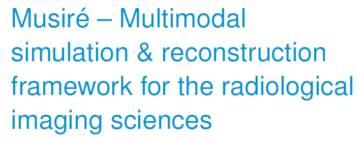
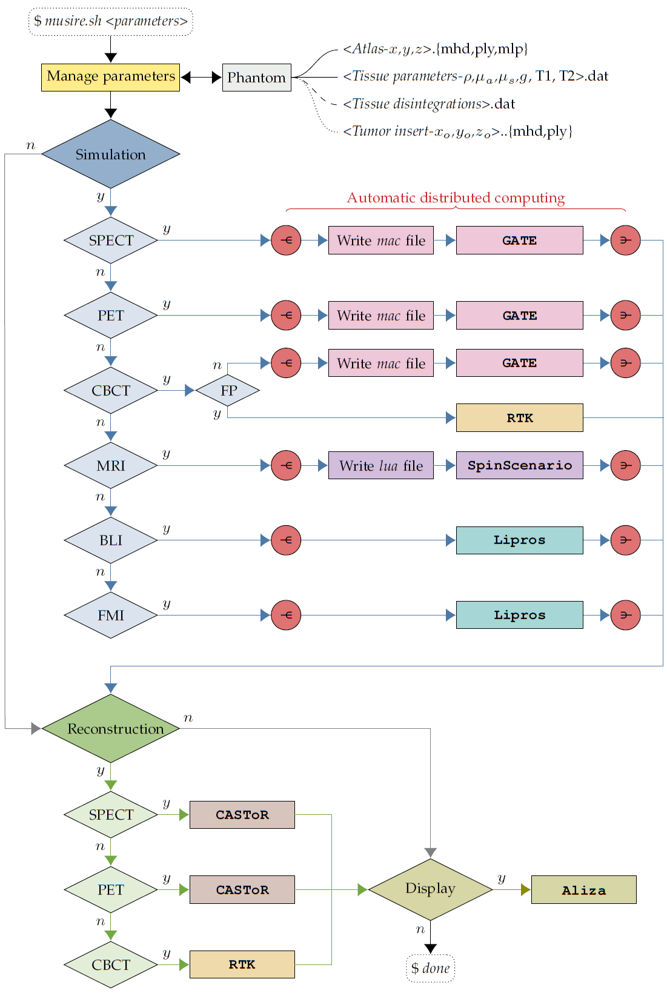
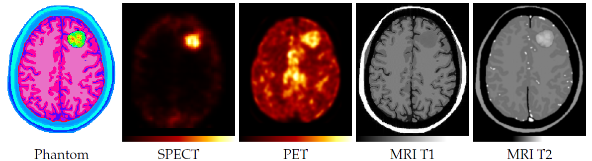

 

Copyright © German Cancer Research Center (DKFZ), <a href="https://www.dkfz.de/en/medphysrad/index.php">Division of Medical Physics in Radiology</a>. 

Please make sure that your usage of this code is in compliance with the code <a href="./LICENSE">license</a>.

## Overview

Musiré is proposed for managing the execution of simulation and image reconstruction for SPECT, PET, CBCT, MRI, BLI, and FMI packages in single and multimodal biomedical imaging applications.

The workflow is composed of a Bash script, the purpose of which being to provide an interface to the user, and to organise data flow between dedicated programs for simulation and reconstruction.

The currently incorporated simulation programs comprise of <a href="http://www.opengatecollaboration.org/">Gate</a> for Monte Carlo simulation of SPECT, PET and CBCT, <a href="https://github.com/spin-scenario/spin-scenario">Spin-Scenario</a> for simulating MRI, and <a href="https://github.com/dkfz-med-phys-rad/lipros">Lipros</a> for Monte Carlo simulation of BLI and FMI.
Currently incorporated image reconstruction programs include <a href="https://www.castor-project.org/">Castor</a> for SPECT and PET as well as <a href="https://www.openrtk.org/">RTK</a> for CBCT.

MetaImage (mhd) standard is used for voxelized phantom and image data format.
Meshlab project (mlp) containers incorporating polygon meshes and point clouds defined by the Stanford triangle format (ply) are employed to represent anatomical structures for optical simulation, and to represent tumour cell inserts.

A number of auxiliary programs inside the <a href="./tools/">tools</a> sub-directory have been developed for data transformation and adaptive parameter assignment.

The software workflow utilizes fully automatic distribution to, and consolidation from, any number of Linux workstations and CPU cores.

## How to cite this code
Please cite the following publication:

        @article{PETER2021,
        author = "J Peter"
        title = "Musiré: multimodal simulation and reconstruction framework for the radiological imaging sciences",
        journal = "Philosophical Transactions of the Royal Society A",
        issue = "Synergistic tomographic image reconstruction: part 2"
        volume = "379",
        year = "2021",
        issn = "",
        doi = "https://doi.org/",
        url = "http://www.sciencedirect.com/science/article/",
        }

